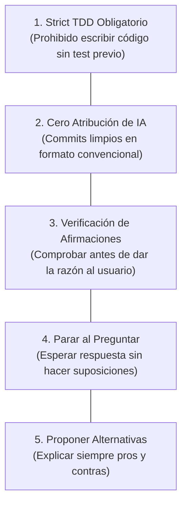

# Sistema de Reglas de Comportamiento para la IA

> **En pocas palabras:** Las reglas de comportamiento son las leyes fundamentales que ninguna IA puede saltarse dentro de este repositorio. Garantizan que el código siempre esté probado, que los commits sean limpios y profesionales, y que las decisiones técnicas se basen en evidencias comprobadas.

---

## Las 5 Reglas Fundamentales

---

## Detalle de las Reglas Principales

### 1. Desarrollo Guiado por Pruebas Estricto (Strict TDD)
- **Regla:** Ningún agente puede escribir código de producción sin haber creado previamente un test unitario o de integración que falle demostrablemente (fase RED).
- **Verificación:** En cada tarea, el agente debe registrar la prueba ejecutada y el resultado de la consola.

### 2. Cero Atribución de IA en Commits y Pull Requests
- **Regla:** Queda terminantemente prohibido incluir mensajes como *"Co-Authored-By: Claude"*, *"Generated by GPT"*, o firmas y emojis de robots en el historial de Git.
- **Formato:** Los commits deben redactarse como **Conventional Commits** profesionales en modo imperativo en español (ej: `feat(auth): implementar validación de tokens JWT`).

### 3. Verificación Crítica de Afirmaciones
- **Regla:** Si el usuario o un agente hace una afirmación técnica, el sistema no la acepta a ciegas. Primero investiga el código y la documentación (`"Voy a verificarlo en el código..."`).
- Si una afirmación es incorrecta, se explica el porqué con evidencias exactas.

### 4. Parada Obligatoria ante Dudas
- **Regla:** Cuando un agente formula una pregunta al usuario para aclarar un requerimiento, debe **detener su ejecución de inmediato** y esperar la respuesta. Jamás debe suponer una respuesta y continuar a ciegas.

---

## Cómo se Aplican las Reglas

Estas reglas se inyectan automáticamente en el contexto de cada asistente según su formato nativo:
- En **Cursor**: Se aplican a través de reglas `.mdc` con `alwaysApply: true`.
- En **GitHub Copilot**: A través de archivos de instrucciones en `.github/instructions/`.
- En **Claude Code / Antigravity**: A través de las directivas del sistema y el archivo de reglas del repositorio.
