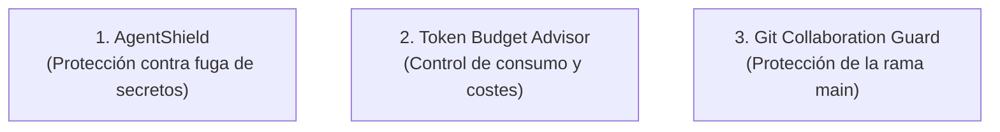

# Guardrails de Seguridad, Secretos y Presupuestos

> **En pocas palabras:** Es fácil que una IA cometa un descuido, como incluir una clave privada en un commit o consumir miles de tokens en un bucle infinito. Los **Guardrails** son los escudos protectores del harness que interceptan y bloquean estos peligros antes de que causen daños.

---

## Los 3 Escudos Protectores

---

## 1. AgentShield: Detección y Bloqueo de Secretos
- **¿Qué hace?** Escanea en tiempo real todo el código y los comandos que la IA intenta escribir.
- **¿Qué detecta?** Tokens de GitHub, claves de AWS, contraseñas de bases de datos, claves privadas SSH y variables de entorno sensibles (`.env`).
- **Acción:** Si detecta un secreto, **aborta la operación de inmediato** y solicita al usuario utilizar variables de entorno seguras.

---

## 2. Token Budget Advisor: Control de Gasto
- **¿Qué hace?** Supervisa el tamaño de las respuestas y los prompts enviados al modelo.
- **¿Por qué es vital?** Evita respuestas redundantes de 2.000 líneas cuando bastaba una explicación de 3 párrafos, ahorrando hasta un 60% en la factura de tokens de tu equipo.
- Permite al usuario elegir el nivel de detalle deseado (`corto`, `estándar`, `exhaustivo`).

---

## 3. Git Collaboration Guard: Protección del Historial
- **¿Qué hace?** Evita que un agente haga commits directos o push destructivos sobre la rama principal (`main`).
- **Obliga a trabajar con ramas:** Todos los cambios deben pasar por una rama de feature (`feat/...` o `fix/...`) y un Pull Request con pruebas verificadas.
