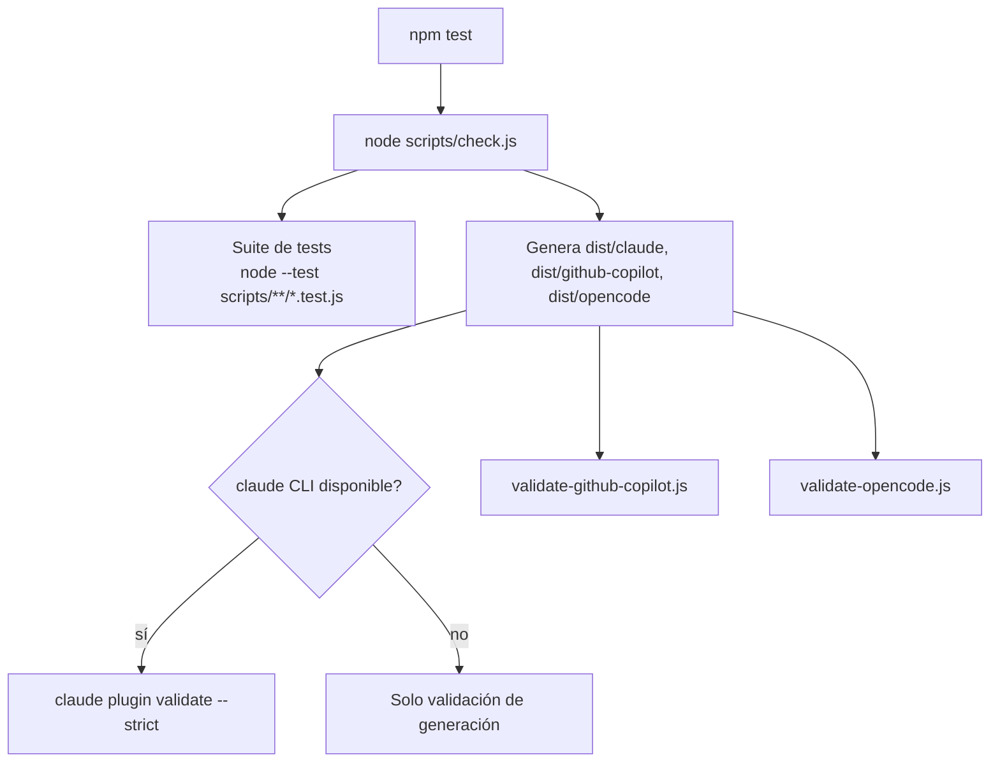

# Testing y calidad

`ospec-workflow` aplica Strict TDD a su propio desarrollo y ofrece una
política declarativa de quality gates que `sdd-verify` evalúa en los cambios
que gestiona. Este dominio cubre ambas capas: cómo se testea el propio
harness y cómo un proyecto que lo adopta puede declarar sus propias puertas
de calidad.

## Cómo se testea el propio harness

- **Runner**: Node.js native test runner (`node --test`), sin frameworks
  externos.
- **Comando único**: `npm test` → `node scripts/check.js`.
- **Cobertura**: 20+ archivos `scripts/**/*.test.js` (unitarios e
  integración) más los tests Go en `internal/hooks/*_test.go` y
  `cmd/ospec-hooks/*_test.go`.

`scripts/check.js` es el comando único de verificación local y CI: ejecuta la
suite de tests, genera y valida los tres targets no-canónicos (`claude`,
`github-copilot`, `opencode`) contra sus validadores, y sondea si el CLI
externo `claude` está disponible — si no lo está, valida solo la generación
(ejercita la transformación) sin el gate estricto de `claude plugin
validate`.

## Strict TDD en el propio repositorio

El hook `pre-commit` (ver [Guardrails de seguridad](../security/guardrails.md))
hace cumplir la paridad código/test localmente: si hay código de producción
staged (`internal/**/*.go`, `scripts/hooks/*.js`, etc.) sin un test
correspondiente (`*_test.go`, `*.test.js`) o sin `tasks.md` del cambio activo
staged, el commit se bloquea.

## Quality gates declarativos para proyectos adoptantes (`sdd-verify`)

`openspec/config.yaml` soporta una clave opcional `quality_gates:` con cuatro
slots tipados: `tests`, `lint`, `architecture`, `security`. **La ausencia de
este bloque es un no-op estricto** — el comportamiento de verify es idéntico
al baseline previo a esta funcionalidad.

| Campo | Tipo | Default | Descripción |
| --- | --- | --- | --- |
| `{gate}.required` | boolean | `false` | Si el fallo del gate afecta el resultado de verificación |
| `{gate}.command` | string | ausente | Comando shell a ejecutar; ausente = se salta con advertencia |
| `{gate}.on_fail` | `advisory` \| `halt` | `advisory` | Enforcement cuando `required: true` y el gate falla |
| `tests.coverage.minimum` | integer 0–100 | ausente | Piso de cobertura; ausente = sin chequeo de cobertura |
| `tests.coverage.command` | string | ausente | Comando cuyo stdout es el % de cobertura |

Claves de gate desconocidas se ignoran silenciosamente (forward-compat).

### Semántica de evaluación por gate

1. Si `command` está ausente/vacío → estado **skipped**.
2. Ejecuta el `command` configurado. Exit code 0 → **pass**; no-cero → **fail**.
3. Para `tests`: si `coverage.minimum` está definido, corre
   `tests.coverage.command` y parsea su stdout como porcentaje. Por debajo
   del mínimo → **fail**, independientemente del exit code del comando
   principal. Si `tests.coverage.command` está ausente → se salta con
   advertencia, nunca hace fallar el gate.
4. `sdd-verify` DEBE evaluar **todos** los gates declarados antes de aplicar
   cualquier enforcement — fail-fast dentro del loop de gates está prohibido.
5. `on_fail: advisory` (default) registra un hallazgo WARNING sin bloquear
   archive; `on_fail: halt` registra un BLOCKER que bloquea archive hasta
   resolverse o anularse explícitamente.

## Por qué la arquitectura está diseñada así

Que `quality_gates:` sea estrictamente opt-in y no-op en ausencia evita
romper proyectos que adoptan `ospec-workflow` sin configurar nada extra. Que
`sdd-verify` evalúe todos los gates antes de aplicar enforcement da al
usuario visibilidad completa del estado de calidad en un solo reporte, en vez
de detenerse en el primer fallo y ocultar el resto.

## Principales puntos de extensión

- Declarar quality gates en un proyecto: descomentar y completar el bloque
  `quality_gates:` en `openspec/config.yaml` (ver el bloque comentado de
  referencia al final del archivo).
- Agregar un nuevo slot de gate: requiere un cambio de spec explícito (los
  cuatro slots actuales son el contrato reconocido; nuevas claves a nivel
  `quality_gates:` se ignoran hasta que se documenten).

## Cosas a vigilar al editar

- No asumas que `on_fail` bloquea por defecto — el default es siempre
  `advisory` incluso si `required: true`; hace falta declarar `on_fail: halt`
  explícitamente.
- Un stdout de cobertura fuera de rango (no 0–100) se trata como
  skip-with-warning, **nunca se clampa**.
- `scripts/check.js` no falla si el CLI `claude` no está instalado — solo
  reduce el alcance de validación del target claude a generación pura.

## Mapa de fuentes

- `/openspec/specs/quality-gates/spec.md`
- `/scripts/check.js`
- `/package.json` (script `test`)
- `/skills/sdd-verify/SKILL.md`
- `/openspec/config.yaml` (bloque comentado `quality_gates:`)
