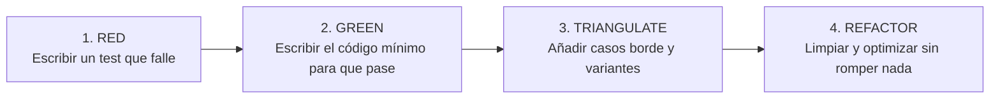

# Testing, Calidad y Strict TDD

> **En pocas palabras:** La calidad no se comprueba al final del proyecto, se construye desde el primer minuto. `ospec-workflow` aplica **Desarrollo Guiado por Pruebas Estricto (Strict TDD)**: está prohibido escribir código si no existe primero un test que demuestre que la funcionalidad hace falta y que falle limpiamente.

---

## El Ciclo de Desarrollo TDD

```mermaid
flowchart LR
    A["1. RED
Escribir un test que falle"] --> B["2. GREEN
Escribir el código mínimo para que pase"]
    B --> C["3. TRIANGULATE
Añadir casos borde y variantes"]
    C --> D["4. REFACTOR
Limpiar y optimizar sin romper nada"]
```

1. **RED (Rojo):** Se escribe un test unitario que describa el nuevo comportamiento. Al ejecutarlo, debe fallar demostrando que la funcionalidad aún no existe.
2. **GREEN (Verde):** Se escribe únicamente el código imprescindible para que el test pase exitosamente.
3. **TRIANGULATE (Triangulación):** Se agregan pruebas adicionales para casos límite y entradas inesperadas.
4. **REFACTOR (Refactorización):** Se mejora la estructura del código asegurando que todos los tests continúen en verde.

---

## La Tabla de Evidencias de Ejecución

Durante la fase de aplicación (`sdd-apply`), los agentes registran sus avances en una tabla de evidencias dentro de `apply-progress.md`:

| Tarea | Archivo de Test | Capa | RED (Falla) | GREEN (Pasa) | Refactor | Notas |
|---|---|---|---|---|---|---|
| Crear endpoint login | `auth.test.ts` | API | ✅ (404 esperado) | ✅ (200 OK) | ✅ Limpieza | Ruta base completada |

---

## Verificación Independiente (`sdd-verify`)

Una vez que el programador termina, entra en acción el agente **`sdd-verify`**:
- Vuelve a ejecutar todos los tests en la consola del sistema.
- Comprueba que no haya tests vacíos, falsos positivos o pruebas que nunca ejerciten el código real.
- Solo si todas las pruebas pasan de verdad, autoriza el paso al archivo y despliegue del cambio.
