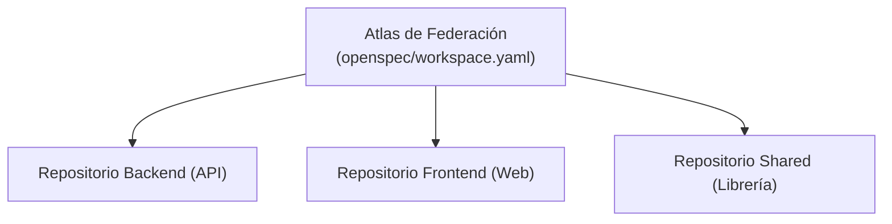

# Federación de Workspaces Multi-Repositorio

> **En pocas palabras:** En organizaciones grandes, un cambio de software suele involucrar varios repositorios a la vez (por ejemplo, el backend, el frontend y la librería de componentes). La **Federación de Workspaces** coordina estos repositorios para que el ciclo SDD aplique y verifique cambios cruzados de forma unificada y segura.

---

## Cómo Funciona el Atlas de Federación

1. **Marcador de Miembro:** Cada repositorio participante contiene un archivo marcador (`openspec/federation.member.yaml`) que define su rol e identidad.
2. **Atlas Central:** El orquestador federado (`sdd-workspace`) lee los marcadores y genera un mapa coordinado de dependencias.
3. **Análisis de Impacto:** Antes de aplicar un cambio, evalúa si una modificación en un repositorio afectará a los contratos o APIs de los repositorios hermanos.
